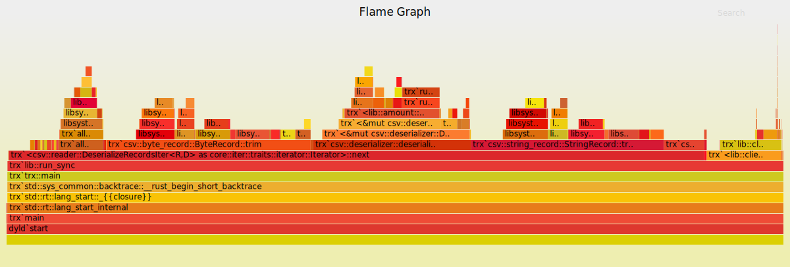
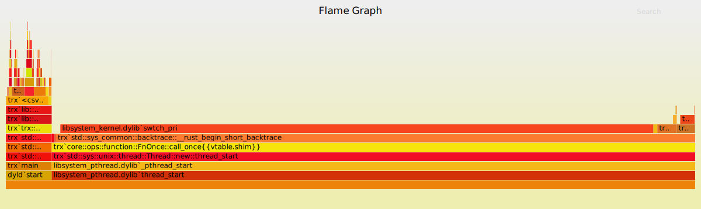
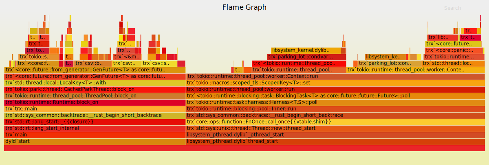
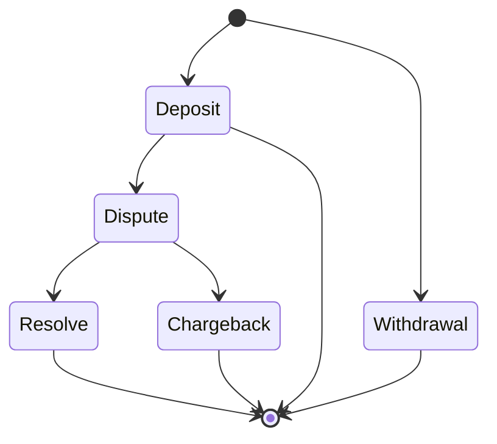

# Trx

<p align="center">
  
</p>

## Running the binary

The binary outputs to stdout, so you can easily redirect the output to a file

```sh
cargo run  -- <path> > <output file>

# concrete example

cargo run -- test_assets/single_client/spec.csv > accounts.csv

# with the release flag
cargo run --release -- test_assets/single_client/spec.csv > accounts.csv
```

## Testing

This repo can be tested with the default rust toolchain

```sh
cargo test
```

This will run both the unit, doc and integration tests.

The benchmarks can be run with

```sh
cargo bench
```

A number of test assets can be found in the [test_assets](test_assets) directory.

## Docs

Rust docs can be built and viewed locally via

```sh
cargo doc --open
```

this is recommended in order explore what is exposed in the crate

## Solutions & Benchmarks

There are 3 available solutions to this problem - please generate the docs to read more about how each one works

1. A [single-threaded synchronous client](src/clients/synchronous.rs) (aka `single-thread`)
2. A [multi-threaded client](src/clients/stream_like.rs) _(think of a simplified version of Kafka or AWS Kinesis)_ (aka `multi-thread`)
3. An [async task based client](src/clients/actor_like.rs) _(could be viewed as a simplified actor pattern)_ (aka `async-task`)

The default entry-point to the binary exposed by this repository uses the `single-thread` implementation.

### Performance

The below benchmarks were generated off the same dataset as the flamegraphs, unfortunately it's too large to commit to
GitHub, but contains 5,000,000 CSV rows and approximately 250 unique clients.

_Note:_ the data set used to generate the
below results is different to the one that will be included if you run `cargo bench` - which is currently pointing to
`test_assets/larger`.

| name            | performance                   |
| --------------- | ----------------------------- |
| `single-thread` | `[4.3701s, 4.3879s, 4.4114s]` |
| `multi-thread`  | `[7.3678s, 7.5490s, 7.7421s]` |
| `async-task`    | `[6.4912s, 6.5779s, 6.6718s]` |

#### Commentary

The above performance was largely what I expected given the compute performed on each CSV row is minimal - _some basic
mathematical operations and a few hashmap lookups/inserts_.

Although the concurrency based solutions in theory allow multiple rows to be processed at the same time,
the overhead associated with the concurrency _ie. passing & receiving messages through channels, managing wake-ups etc_
end up contributing more to the overall runtime than if the data was just processed sequentially.

This is primarily true as the solutions implemented attempt to process the data in as close to _"real time"
(ie. we process the record as soon as it comes in)_ as possible, .

If eventual consistency was acceptable, it's possible that an epoch based solution might allow for better concurrency and
_possibly_ overall perfomance gains - a solution where you would collect all data for an epoch and then resolve it in
parallel - this solution would allow you to use other data structures and as such could potentially avoid some of that
over head _(although they would have their own overhead)_. This would have to be profiled and tested to be verified
though, at this point it is just an idea.

##### FlameGraphs

There are flamegraphs available for the 3 implementations - these were generated running over an identical data set of 5,000,000
CSV rows with approximately 250 unique clients - _unfortunately this dataset is too large to upload to GitHub_. These can be found in the [flamegraph directory](/flamegraphs) or below

###### [Single-Thread](https://raw.githubusercontent.com/naamancurtis/trx/main/flamegraphs/single-thread-flamegraph.svg)



###### [Multi-Thread](https://raw.githubusercontent.com/naamancurtis/trx/main/flamegraphs/multi-thread-flamegraph.svg)



###### [Async](https://raw.githubusercontent.com/naamancurtis/trx/main/flamegraphs/async-flamegraph.svg)



## Assumptions

### Dispute mechanism

**My interpretation of this requirement**

- In the case of a `Dispute` on a `Deposit`. In this scenario it implies that through some
  mechanism external to the system, the client has forcefully reversed a transaction `Chargeback`. For example they've asked their
  card issuer to cancel a deposit before the funds were actually released to the system. This implies that either
  something went in a manner that the customer really did not expect it to, something went wrong on our end or the client has
  malious intentions on the system, therefore freezing the account for review makes sense.
- In the case of a `Dispute` on a `Withdrawal`, this requirement is slightly more vague to me. If we go with the
  assumption that a withdrawal can only be made to a single/list of **approved** accounts _as is commonly seen on
  trading platforms_ the notion of a malicious third party withdrawing funds shouldn't exist - as funds can only be
  withdrawn to the clients bank account.
  - In turn this would imply that the only scenario that could be disputed is if the system thought that a
    withdrawal had been made, but for some reason the funds hadn't actually been released to the account eg. there was
    an error with the client's banks network. From our
    systems perspective, the funds have left the system, therefore the client cannot trade with said funds _(although
    the client believes the funds still exist in the system)_. Therefore from our system's perspective there is no reason
    to apply `Dispute` logic on a `Withdrawal` (which would further reduce the client's available funds). Therefore for
    the sake of this exercise it is **NOT** possible to `Dispute` a `Withdrawal`.

### Valid State Transitions

- Assuming the state transitions detailed below are valid.
  - _Key callout:_ Once a transaction is either resolved, it cannot transition backwards to `Dispute` again.



### Decimal Rounding Strategy

The rounding strategy that will be used is `Bankers Rounding`. Although I don't have much
professional experience working with currency, this seems a reasonable choice given the increased stability it offers.
Ultimately this would be a **business decision** on how they want to enforce the rounding strategy. For this exercise the
fact that the transaction amounts are in fiat currency _(from a quick search a majority of fiat currencies don't go beyond 2 dp, although there
are a few that go to 3 and 4dp)_, and the requirements specify to carry transactions through to 4dp, makes me believe
this is a safe assumption.

## Improvements to make if I had more time or wanted to productionize this

- Can always improve the amount of testing/test coverage, both at a unit and integration level. On a similar note, also improve the assertions which were done very quickly.
  - Potentially use a crate such as [spectral](https://docs.rs/spectral/latest/spectral/) to enhance how the assertions
    read
- Improve the error paradigm throughout the application. In a quick project something like `anyhow` or `eyre` is okay,
  however for something that is looking to go into production, I prefer something more robust - ideally without _magic_
  strings everywhere.
  - A tangible example of this would be to have an `ErrorKind` type enum for matching on errors instead of performing
    string matching
- Improve the Telemetry, I've not included a `tracing::subscriber` primarily because I'm not sure if automated tests will look at
  performance, and any form of telemetry emission will have an effect on that. Similarly I can't log to `stdout` given
  the requirements of how the binary will be invoked.
  - Having said that, this project does include enough telemetry to get started (the event emission is implemented)
    however it could probably do some re-visiting and tidying up.

## Security

```txt
cargo audit
    Fetching advisory database from `https://github.com/RustSec/advisory-db.git`
      Loaded 421 security advisories (from /Users/naaman/.cargo/advisory-db)
    Updating crates.io index
    Scanning Cargo.lock for vulnerabilities (140 crate dependencies)
Crate:     serde_cbor
Version:   0.11.2
Warning:   unmaintained
Title:     serde_cbor is unmaintained
Date:      2021-08-15
ID:        RUSTSEC-2021-0127
URL:       https://rustsec.org/advisories/RUSTSEC-2021-0127
Dependency tree:
serde_cbor 0.11.2
└── criterion 0.3.6
    └── transactions 0.1.0

warning: 1 allowed warning found
```
