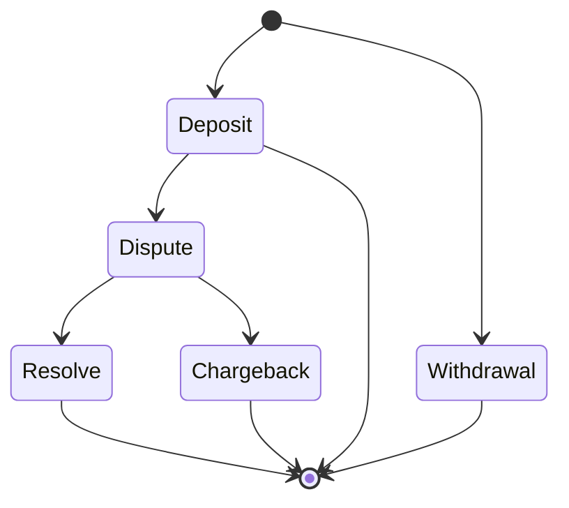

# Trx

## Running the binary

The binary outputs to stdout, so you can easily redirect the output to a file

```sh
cargo run  -- <path> > accounts.csv

# concrete example

cargo run -- test_assets/single_client/spec.csv > accounts.csv

# with the release flag
cargo run --release -- test_assets/single_client/spec.csv > accounts.csv
```

## Testing

The binary can be tested with the default rust toolchain

```sh
cargo test
```

This will run both the unit and integration tests

### Assets

A number of test assets can be found in the `test_assets` directory. _Note_ the `huge` directory hasn't been validated
for correctness manually. The data was generated to have a slightly larger dataset

## Docs

Rust docs can be built and viewed locally via

```sh
cargo doc --open
```

## Assumptions

### Dispute mechanism

- **My interpretation of this requirement**
  - In the case of a `Dispute` on a `Deposit`. In this scenario it implies that through some
    mechanism external to the system, the client has forcefully reversed a transaction `Chargeback`. For example they've asked their
    card issuer to cancel a deposit before the funds were actually released to the system. This implies that either
    something went in a manner that the customer really did not expect it to, something went wrong on our end or the client has
    malious intentions on the system, therefore freezing the account for review makes sense.
  - In the case of a `Dispute` on a `Withdrawal`, this requirement is slightly more vague to me. If we go with the
    assumption that a withdrawal can only be made to a single/list of **approved** accounts _as is commonly seen on
    trading platforms_ the notion of a malicious third party withdrawing funds shouldn't exist - as funds can only be
    withdrawn to the clients bank account.
    - In turn this would imply that the only scenario that could be disputed is if the system thought that a
      withdrawal had been made, but for some reason the funds hadn't actually been released to the account eg. there was
      an error with the client's banks network. From our
      systems perspective, the funds have left the system, therefore the client cannot trade with said funds _(although
      the client believes the funds still exist in the system)_. Therefore from our system's perspective there is no reason
      to apply `Dispute` logic on a `Withdrawal` (which would further reduce the client's available funds). Therefore for
      the sake of this exercise it is **NOT** possible to `Dispute` a `Withdrawal`.

### Valid State Transitions

- Assuming the state transitions detailed below are valid.
  - _Key callout:_ Once a transaction is either resolved, it cannot transition backwards to `Dispute` again.



### Decimal Rounding Strategy

The rounding strategy that will be used is `Bankers Rounding`. Although I don't have much
professional experience working with currency, this seems a reasonable choice given the increased stability it offers.
Ultimately this would be a **business decision** on how they want to enforce the rounding strategy. For this exercise the
fact that the transaction amounts are in fiat currency _(from a quick search a majority of fiat currencies don't go beyond 2 dp, although there
are a few that go to 3 and 4dp)_, and the requirements specify to carry transactions through to 4dp, makes me believe
this is a safe assumption.

### Transaction ID Uniqueness

The spec mentions that the transaction ID is _globally unique_, as such I will make the assumption that there is no need to track
previously seen ID's and verify that they aren't duplicated. Eg. We couldn't run into a scenario where we get a Deposit with ID 1,
then get another deposit with ID 1.

## Improvements to make if I had more time

- There's a reasonable amount of hashing going on for lookups and inserts, I'm reasonably certain this could be optimised throughout the app.
- Can always improve the amount of testing/test coverage, both at a unit and integration level. On a similar note, also improve the assertions which were done very quickly.
  - Potentially use a crate such as [spectral](https://docs.rs/spectral/latest/spectral/)
